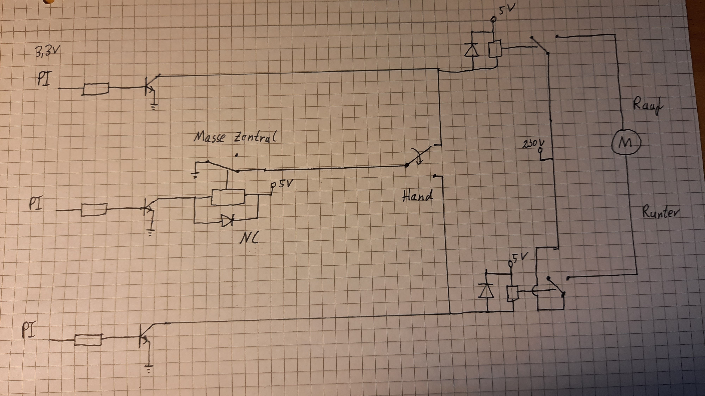
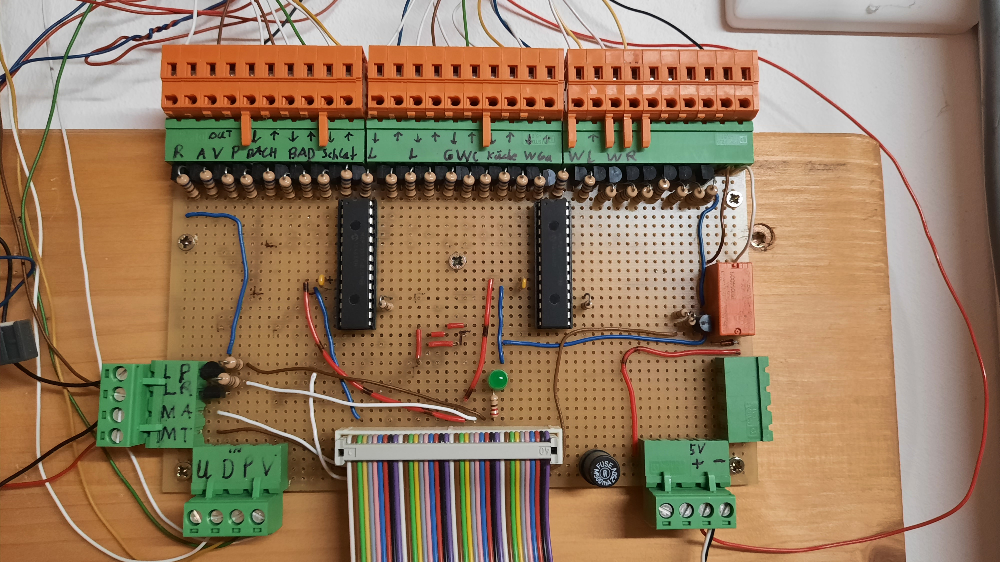
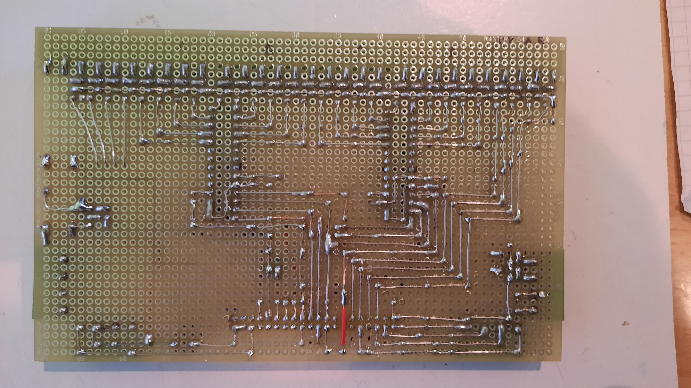

# Haussteuerung

In diesem Repository ist eine selbstprogammierte Haussteuerung enthalten.

## Einführung

Die Haussteuerung meines Vaters, die auf einem Arduino Uno programmiert wurde, habe ich nun durch einen Raspberry Pi ersetzt.
Durch den Einsatz des Raspberry Pis sind noch einige neue Features hinzugekommen, die mit einem Arduino nur schwer, oder gar nicht umzusetzen sind.
Das neue Main-Feature ist das Hosten einer Website, womit zusätzliche Einstellungsmöglichkeiten gegeben sind.

In diesem Repository ist bis auf "portExpander.py" alles selber geschrieben. Den [Inhalt](https://github.com/petrockblog/RPi-MCP23S17)
habe ich aus diesem Repository. Ich habe einige Zeilen geändert, weil einiges bei mir nicht funktioniert hat.
Die HTML-Kenntnisse stammen hautsächlich aus der Schule und Python habe ich mir komplett selber beigebracht.
Daher kann es hier und da mal ein wenig "unschön" sein.

## Features

* Das Fahren der Rolladen im Haus abhängig von einer eingestellten Zeit oder vom Sonnenaufgang oder Sonnenuntergang
* Einschalten/Ausschalten eines Radios oder der Lüftung im Badezimmer
* Einschalten einer Warmwasserpumpe
* Das Einschalten einer Alarmanlage mit einem automatischen E-Mail Versand, falls Fenster geöffnet werden
* Das Hosten einer Website um genau diese Features einzustellen

## Abhängigkeiten

Folgende Packete sind auf dem Pi installiert:

* **astral 2.2**
* bidict 0.21.2
* click 8.01
* colorzero 2.0
* dnspython 1.16.0
* **eventlet 0.31.1**
* **Flask 2.0.1**
* **Flask-socket-io 5.1.0**
* **gpiozero 1.6.2**
* greenlet 1.1.0
* importlib-metadata 4.6.1
* itsdangerous 2.0.1
* Jinja 2 3.01
* MarkupSafe 2.0.1
* python-enginio 4.2.0
* python-socketio 5.3.0
* pytz 2021.1
* **RPi.GPIO 0.7.0**
* setuptools 57.1.0
* six 1.16.0
* spidev 3.5
* typing-extensions 3.100.0
* werkzeug 2.0.1
* wheel 0.36.2
* zipp 3.5.0

Alle **markierten** sind selber installiert worden.

## Installation

Alle oben genannten Packete liegen in einem virtuellen Python environment. Die Python Version ist 3.7.3. 
Auf dem Raspberry Pi läuft Raspian GNU/Linux 10 (Buster). 
Zum Installiern der packages habe ich pip 21.2.4 genutzt. 

Die gesamten Files liegen bis auf die HTML-Files in einem Ordner. 
Mit `crontab -e` und der Zeile in *crontab.txt* wird dann das Skript automatisch nach dem starten des Pis gestartet. 
(Natürlich muss man den Pfad anpassen!)

Zusätzlich sollten noch die Name der Räume angepasst werden, eine eigene E-Mail angegeben werden und der Ort in sunTimeHandler.py.

## Schaltplan

Das Hoch-und Runterfahren der Rolladen wird über drei verschiedene Relais gesteuert. Das Relais "Masse Zentral" ist dafür da,
dass das manuelle Fahren der Rolladen über die normalen Schalter verhindert wird, wenn die Rolladen über die Website gefahren werden.
Die Vorderseite und Rückseite der Platine ist ebenfalls abgebildet.

||
|:--:|
|Schaltplan für Rolladensteuerung|

||
|:--:|
|Vorderseite der Platine mit Verdrahtung ins Haus|

||
|:--:|
|Rückseite der Platine|